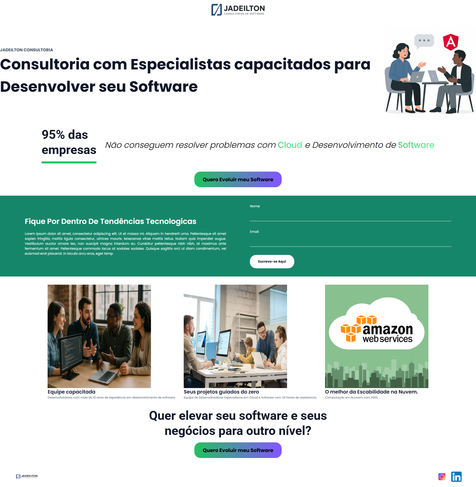

💼 Jadeilton Consultoria — Landing Page Profissional com Angular
Landing page desenvolvida em Angular para uma empresa fictícia de consultoria especializada em desenvolvimento de software e soluções em nuvem (Cloud). O objetivo da página é atrair leads, apresentar diferenciais e promover serviços com foco em empresas que enfrentam desafios tecnológicos.

🚀 Sobre o Projeto
Essa landing page foi pensada para transmitir autoridade técnica e confiança a potenciais clientes de tecnologia. Entre os principais destaques:

Design moderno, responsivo e focado em conversão

Seções com CTA (Call To Action) claros

Integração visual com serviços em nuvem (AWS)

Formulário funcional para captação de leads

Destaque para equipe técnica e diferenciais da consultoria

🛠️ Tecnologias Utilizadas
✅ Angular 17+

✅ TypeScript

✅ HTML5 e CSS3 (com Flexbox e Grid)

✅ Responsividade

✅ Estilo moderno com foco em UI/UX

📸 Layout da Página
A landing page é composta por:

Header institucional com logo e chamada principal

Indicadores de autoridade (como “95% das empresas...”)

Botão de ação com destaque visual

Formulário de inscrição

Cards explicativos com imagens e textos

Sessão sobre tecnologias em nuvem (AWS)
